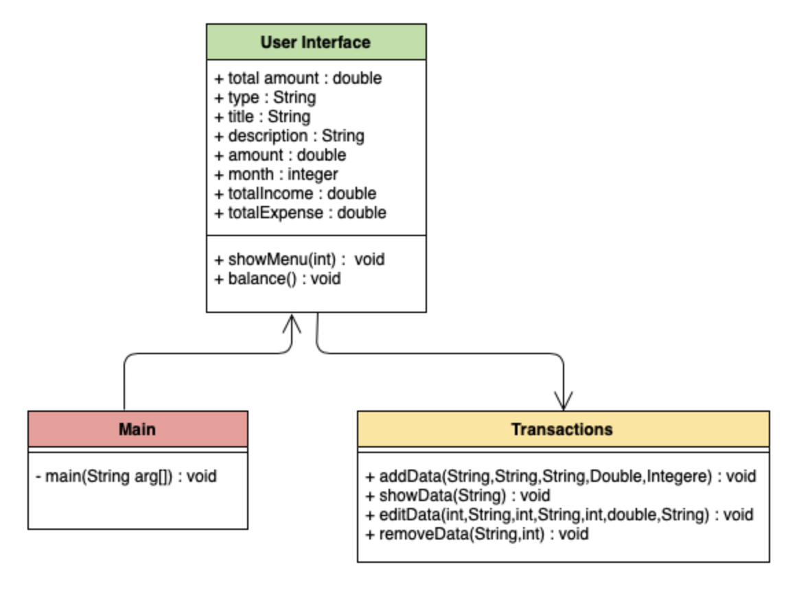

<p align="center">
 
 <h2 align="center">Money tracker</h2>

### About us

Money tracker application is used to manage the application user’s daily expenses in more efficient and manageable way.

By using the application we can reduce manual calculation for their daily expenses and keep track of expenditure.

In this application user can provide his income to calculate his total expense and these result will store for user.

### Installation
<h5 align="center">Install JDK on MacOS</h5>
1. Install Homebrew : Open terminal and run this command to install Homebrew.

```sh
/bin/bash -c "$(curl -fsSL https://raw.githubusercontent.com/Homebrew/install/master/install.sh)"
```

2. Install Java : after installing homebrew. run below command to install java.

```sh
$ brew cask install java
```

3. To check java version run below command in terminal.

```JS
java -version
```


<h5 align="center">Install JDK on Windows</h5>

1. Download java : Goto Java SE download site @ http://www.oracle.com/technetwork/java/javase/downloads/index.html.

2. Install Java : Once the download is complete, run the exe for install JDK.

3. To check java version run below command in terminal.

```JS
java -version
```

### Run program in terminal

1. Download program from github or clone github repository to your local computer.

2. open terminal go to the folder where you want to clone repository.

3. To clone Github repository copy ssh link and run below command in terminal.  

```JS
git clone git@github.com:youremailid.git(paste your ssh link here)
```

4. go to the folder where you clone the repository and run below command to build project.

```JS
./gradlew clean build
```

<p align="center">
 

5. run this command to run program. 
```JS
Java -jar ./build/libs/Money_Tracker.jar
```
<p align="center">
 

### User Guide
1. In money tracker application user can add, edit, remove and see all transactions.
after running the program you can see this window. Select option to run operation.

<p align="center">
 

2. If you want to see present data select option 1.

<p align="center">


3. To add data select option 2. In add option there are two options income and expense. According to data select option and add details.

<p align="center">


4. In option 3 you can edit or remove data. In edit option you can edit data according to you choice.

<p align="center">


5. If you want to quite or save data select option 4.

<p align="center">


### UML Diagrams
<hr/>
<h5 align="center">Use Case Diagram</h5>
<hr/>

<p align="center">

<hr/>

<p align="center">
<h5 align="center">Sequence Diagram</h5>
<hr/>

<p align="center">

<hr/>

<p align="center">
<h5 align="center">Activity Diagram</h5>
<hr/>

<p align="center">

<hr/>

<p align="center">
<h5 align="center">Class Diagram</h5>
<hr/>

<p align="center">

<hr/>


